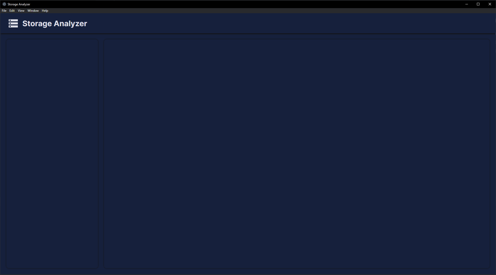

# Storage Analyzer (In progress)

This desktop application will help you manage your device storage by visualizing your directory folders and application size in an intuitive way
using different charts based on the directory path you choose.



## Installation
Node has to be installed
- Go to the root directory
- Execute npm install
```
npm install
```
- Execute the application
```
npm run start:electron
```
In case you want to run watcher (reloads when changes in code)
```
npm run build:watch
```
## Technologies
- React
- Electron
- Typescript
## Contributing
Feel free to fork this repository or create an issue if you want to.